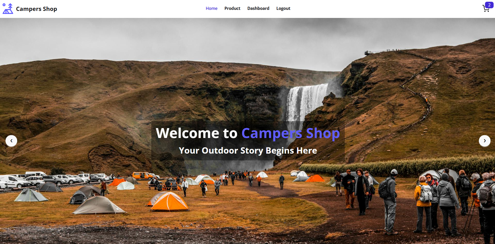

# 🏕️ CamperShop - Simple MERN E-Commerce App

CamperShop is a simple **full-stack MERN e-commerce application** built with **React + TypeScript** on the frontend and **Node.js + Express + MongoDB (Mongoose ORM)** on the backend.  
It features **Role-Based Dashboards**, **Firebase Authentication**, **Stripe Payment Integration**, **Search & Filter**, **Cart & Order Management**, and **Admin CRUD** capabilities.

<!-- Core MERN Stack -->
[](https://www.mongodb.com/)
[](https://expressjs.com/)
[](https://react.dev/)
[](https://nodejs.org/)
[](https://www.typescriptlang.org/)

<!-- Frontend / UI -->
[](https://tailwindcss.com/)
[](https://www.framer.com/motion/)
[](https://redux-toolkit.js.org/)

<!-- Backend / Services -->
[](https://firebase.google.com/)
[](https://stripe.com/)

<!-- Dev Tools -->
[](https://git-scm.com/)
[](https://github.com/features/actions)
[](https://www.docker.com/)
[](https://eslint.org/)
[](https://prettier.io/)

---

[](https://campers-shop-frontend-phi.vercel.app/)


## 🔗 Links

### **Frontend**
- **GitHub:** [CamperShop Frontend](https://github.com/rahimbd7/Assignment-04-Campers-Shop/tree/main/frontend)  
- **Live Demo:** [Frontend Live Link](https://campers-shop-frontend-phi.vercel.app/)

### **Backend**
- **GitHub:** [CamperShop Backend](https://github.com/rahimbd7/Assignment-04-Campers-Shop/tree/main/backend)  
- **Live API:** [Backend Live Link](https://campers-shop-backend-omega.vercel.app/)

---

## 🚀 Features

### **Frontend (React + TypeScript + Redux Toolkit)**
- 🎨 Fully responsive UI with **React** + **Tailwind CSS** + **Framer Motion**
- 🔐 **Firebase Authentication** with **Google** & **GitHub** login
- 🛒 **Cart & Order Management** with Redux Toolkit + LocalStorage
- 💳 **Stripe Payment** using **Stripe Elements**
- 🔍 **Search & Filter Products** by name, price, and category  

**User Dashboard**:  
- View cart items & order history  
- Update user profile  

**Admin Dashboard**:  
- CRUD on products & categories  
- Manage users & order status  

> **Admin Access:** Login with  
> **Email:** `admin@admin.com`  
> **Password:** `admin123`  

---

### **Backend (Node.js + Express + MongoDB + Mongoose)**
- 🔐 **JWT Authentication** for secure endpoints  
- 📦 Product & Order APIs with **Role-Based Access Control**  
- 🗄️ **Mongoose Models** for structured database schemas  
- 💳 **Stripe Payment API** integration  
- 🧑‍💻 **Custom Register & Login** endpoints  

---

## 🛠️ Tech Stack
- **Frontend:** React, TypeScript, Tailwind CSS, Redux Toolkit, Firebase, Framer Motion  
- **Backend:** Node.js, Express.js, TypeScript, Mongoose (MongoDB ORM)  
- **Database:** MongoDB  
- **Payment Gateway:** Stripe  
- **Authentication:** JWT + Firebase  
- **Dev Tools:** Git, Postman, ESLint, Prettier  

---

## ⚙️ Setup & Installation

### 1️⃣ Clone the Repository
```bash
git clone https://github.com/your-username/campershop.git
cd campershop 
```
### 2️⃣ Install Dependencies
```bash
# Using pnpm (Recommended)
pnpm install

# Or using npm
npm install

# Or using yarn
yarn install

```
### 3️⃣ Setup Environment Variables
| Variable Name          | Description            |
|------------------------|-------------------------|
| `VITE_FIREBASE_API_KEY` | Firebase API Key        |
| `STRIPE_SECRET_KEY`     | Stripe Secret Key       |
| `JWT_SECRET`            | JWT Secret for tokens   |
| `MONGO_URI`             | MongoDB connection URI  |

4️⃣ Start Development Servers
```bash
# Frontend (Recommended with pnpm)
cd frontend && pnpm dev
# Or using npm
cd frontend && npm run dev

#Backend (Recommended with pnpm)
cd backend && pnpm dev
# Or
cd backend && npm run dev
```


> **Note:** This project was created using [pnpm](https://pnpm.io/).  
> We recommend using pnpm for faster installs and better disk space usage.  
> However, npm or yarn will also work fine.

<div align="center">
  <strong>All right reserved by @Md Rahim Uddin</strong>  
  <br>
  <a href="#top">Back to top ⬆️</a>
</div>
